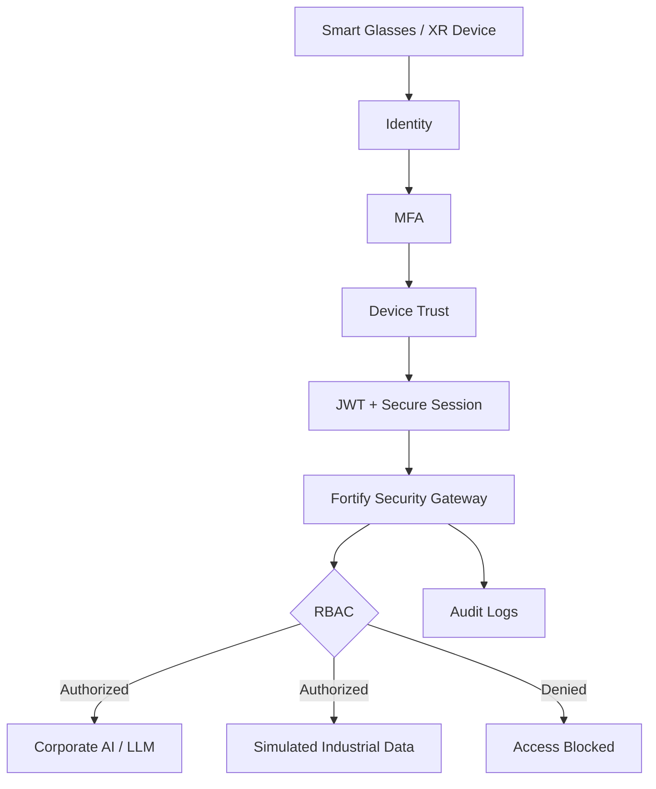

<div align="center">

# 🛡️ Fortify Subsea XR

### Secure AI Access for Smart Glasses, XR & Industrial Operations

**Cybersecurity · IAM · MFA · Device Trust · Zero Trust · WebGL · WebXR · Next.js**

[](https://nextjs.org/)
[](https://react.dev/)
[](https://www.typescriptlang.org/)
[](https://www.khronos.org/webgl/)
[](https://immersiveweb.dev/)
[](https://vercel.com/)

🌐 **Live Demo:** https://fortify-smart-glass.vercel.app

</div>

---

## 🌊 Sobre o projeto

**Fortify Subsea XR** é um protótipo de cibersegurança que demonstra como proteger o acesso a **IA corporativa e dados industriais** quando o usuário utiliza **Smart Glasses, headsets XR ou outros dispositivos vestíveis**.

A ideia central é simples: o wearable **não acessa diretamente** o serviço de IA ou o recurso protegido. Toda requisição passa pelo **Fortify Security Gateway**, que verifica identidade, MFA, confiança do dispositivo, sessão e permissão antes de liberar qualquer dado.

O projeto também possui uma experiência **Subsea XR** em ambiente submarino 3D, criada para demonstrar esse fluxo de segurança de forma visual e imersiva.

> [!IMPORTANT]
> Este repositório é um **protótipo acadêmico e demonstrativo**. Não é um produto oficial, homologado ou operado pela Petrobras. Nomes e marcas de terceiros pertencem aos seus respectivos titulares. Os dados industriais exibidos são fictícios.

---

## ✨ Principais recursos

- 🔐 Autenticação de identidade em múltiplas etapas
- 🔢 MFA com **TOTP** e código alternativo de contingência
- 🥽 **Device Trust** com allowlist de dispositivos
- 🎟️ Sessão autenticada com **JWT**
- 🍪 Cookies de sessão `httpOnly`
- 🧭 Autorização baseada em **RBAC**
- 🛡️ **Fortify Security Gateway** entre o wearable e a IA
- 🧾 Logs e auditoria de operações
- 🌊 Simulador Subsea em **WebGL 3D** para desktop
- 🥽 Suporte a **WebXR / immersive-vr** em headsets compatíveis
- 🤖 ROV animado, partículas, iluminação e atmosfera submarina
- 🏭 Inspeção simulada do módulo industrial fictício **P-101**
- 📡 HUD imersivo com telemetria e estado de segurança
- 📚 Página de documentação técnica dentro da aplicação
- ☁️ Deploy preparado para **Vercel**

---

## 🧠 Conceito de segurança

Sem o Fortify:

```text
Smart Glasses / XR
        ↓
Acesso direto à IA / dados
```

Com o Fortify:

```text
Smart Glasses / XR
        ↓
Identidade
        ↓
MFA
        ↓
Device Trust
        ↓
JWT / Sessão segura
        ↓
Fortify Security Gateway
        ↓
RBAC + Auditoria
        ↓
IA / LLM / Dados industriais
```

---

## 🏗️ Arquitetura



A camada de segurança é independente do modelo de IA. Isso permite proteger diferentes serviços sem colocar credenciais do LLM diretamente no dispositivo cliente.

---

## 🔑 Fluxo de autenticação

```text
/glass/login
      ↓
/glass/mfa
      ↓
/glass/device
      ↓
Secure Session
      ↓
/vr
```

Depois da autenticação completa, o ambiente XR recebe o estado:

```text
IDENTITY        ✓
MFA             ✓
DEVICE TRUST    ✓
JWT SESSION     ✓
RBAC            ✓
```

Caso o dispositivo não seja confiável, o acesso é bloqueado mesmo que usuário e MFA estejam corretos.

---

## 🥽 Fortify Subsea XR

A rota `/vr` transforma a arquitetura de segurança em uma demonstração visual.

### Ambiente simulado

O cenário possui:

- leito oceânico em 3D;
- névoa e profundidade submarina;
- partículas e bolhas;
- dutos e risers;
- estruturas subsea;
- ROV animado;
- módulo industrial **P-101**;
- HUD de inspeção;
- telemetria simulada;
- scanner de equipamentos;
- liberação de informações somente após autorização.

### Desktop Simulator

No computador, o cenário usa **WebGL** e pode ser explorado com mouse e teclado.

### Immersive WebXR

Em browsers/headsets compatíveis, o projeto pode solicitar:

```text
immersive-vr
```

permitindo uma experiência XR real.

---

## 🛡️ Controles implementados

### Identity Authentication

O usuário precisa possuir credenciais válidas para iniciar a cadeia de autenticação.

### Multi-Factor Authentication

O projeto suporta:

- TOTP para aplicativos autenticadores;
- código alternativo de contingência para demonstração.

### Device Trust

O equipamento precisa estar presente na allowlist configurada no servidor.

### JWT + Secure Session

Depois de completar todas as etapas, é emitida uma sessão autenticada. A sessão é enviada por cookie `httpOnly` e validada no servidor antes da abertura da área protegida.

### RBAC

Recursos protegidos podem exigir permissões específicas, por exemplo:

```text
ai.query
documents.read
```

### Audit

Operações relevantes podem ser registradas para rastreabilidade e demonstração de auditoria.

---

## ⚙️ Stack

| Camada | Tecnologia |
|---|---|
| Framework | Next.js 16 |
| UI | React 19 |
| Linguagem | TypeScript |
| 3D | WebGL |
| XR | WebXR |
| Autenticação | JWT + MFA |
| Sessão | Cookies `httpOnly` |
| Autorização | RBAC |
| Hosting | Vercel |

---

## 📁 Estrutura principal

```text
app/
├── glass/
│   ├── login/
│   ├── mfa/
│   ├── device/
│   └── assistant/
│
├── vr/
├── admin/
├── documentacao/
│
└── api/
    └── fortify/
        ├── auth/
        ├── mfa/
        ├── device/
        ├── session/
        ├── ai/
        └── xr/
```

---

## 💻 Executando localmente

### 1. Clone

```bash
git clone <URL_DO_SEU_REPOSITORIO>
cd fortify-subsea-xr
```

### 2. Instale

```bash
npm install
```

### 3. Configure o ambiente

Copie `.env.example` para `.env.local` e configure seus próprios valores:

```env
FORTIFY_DEMO_USER=your_demo_user
FORTIFY_DEMO_PASSWORD=your_demo_password
FORTIFY_MFA_RECOVERY_CODE=your_demo_code
FORTIFY_ALLOWED_DEVICE_IDS=FORTIFY-GLASS-001
FORTIFY_JWT_SECRET=YOUR_LONG_RANDOM_SECRET
FORTIFY_SESSION_TTL_SECONDS=14400

# Optional
FORTIFY_TOTP_SECRET=
LLM_ENDPOINT=
LLM_API_KEY=
```

> [!WARNING]
> Nunca publique `.env.local`, JWT secrets, tokens, senhas reais, certificados privados ou chaves de API.

### 4. Execute

```bash
npm run dev
```

Acesse:

```text
http://localhost:3000
```

---

## 🗺️ Rotas

| Rota | Descrição |
|---|---|
| `/` | Apresentação do projeto |
| `/glass/login` | Login / identidade |
| `/glass/mfa` | Segundo fator |
| `/glass/device` | Device Trust |
| `/vr` | Fortify Subsea XR |
| `/admin` | Console demonstrativo |
| `/documentacao` | Documentação técnica |

---

## ☁️ Deploy na Vercel

Configuração recomendada:

```text
Framework Preset: Next.js
Build Command: Automatic
Output Directory: Automatic
Install Command: Automatic
```

Cadastre os segredos em:

```text
Project → Settings → Environment Variables
```

> Não configure `public` como Output Directory para esta aplicação Next.js.

---

## 🧪 Cenários demonstrados

### ✅ Usuário + MFA + dispositivo confiável

```text
Valid User
    ↓
Valid MFA
    ↓
Trusted Device
    ↓
Valid Session
    ↓
RBAC Authorized
    ↓
ACCESS GRANTED
```

### ⛔ Dispositivo não confiável

```text
Valid User
    ↓
Valid MFA
    ↓
Unknown Device
    ↓
ACCESS DENIED
```

### ⛔ Permissão insuficiente

```text
Authenticated Session
    ↓
Protected Resource
    ↓
RBAC Denied
    ↓
ACCESS DENIED + AUDIT
```

---

## 🔮 Roadmap

Uma evolução corporativa poderia incluir:

- Identity Provider corporativo / OIDC;
- Microsoft Entra ID;
- WebAuthn / FIDO2;
- Hardware Security Keys;
- MDM;
- certificados por dispositivo;
- SIEM;
- DLP;
- banco persistente para usuários e sessões;
- políticas Zero Trust avançadas;
- rotação de tokens;
- integração com LLM corporativo real;
- Digital Twin;
- telemetria industrial real;
- assets 3D industriais de maior fidelidade;
- integração com Smart Glasses reais.

---

## 🎯 O que este projeto demonstra

`Cybersecurity` · `IAM` · `MFA` · `JWT` · `RBAC` · `Zero Trust` · `Secure Gateway` · `Next.js` · `React` · `TypeScript` · `WebGL` · `WebXR` · `XR Security` · `Industrial UX` · `Cloud Deployment`

---

## 🔒 Antes de tornar o repositório público

Verifique se nenhum segredo foi commitado no histórico:

```text
.env
.env.local
API keys
JWT secrets
access tokens
private certificates
production passwords
```

O `.gitignore` deste projeto já ignora os principais arquivos de ambiente, mas se uma chave real tiver sido commitada anteriormente, **rotacione essa chave antes de tornar o repositório público**.

---

## ⚠️ Disclaimer

Fortify Subsea XR é um **protótipo acadêmico e tecnológico** criado para demonstrar conceitos de segurança aplicados a wearables, IA e XR.

A utilização da identidade Petrobras no protótipo serve exclusivamente para contextualização do desafio de inovação. Este projeto **não representa produto oficial, parceria comercial ou solução homologada pela Petrobras**.

Todos os equipamentos, valores operacionais, telemetria e dados industriais exibidos na simulação são fictícios.

---

<div align="center">

### ⭐ Fortify Subsea XR

**Secure access. Trusted devices. Protected intelligence.**

Se o projeto foi útil ou interessante, considere deixar uma **Star ⭐** no repositório.

</div>
